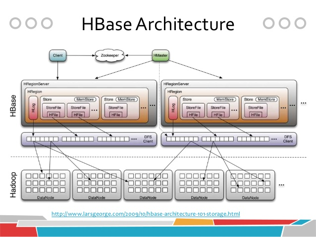

# HBase考试复习

## HBase大数据存取复习概要

考试题型及分值

1. 单选题（每小题1.5分，10个小题，共15分）
2. 判断题（每小题1.5分，10个空，共15分，正确的打√，错误的打×）
3. 程序填空题(每空1.5分，10个空，共15分)
4. 分析简答题（3个小题，每个小题10分，共30分）
5. 综合题（25分）

复习概要

1. 重点复习授课PPT
2. 关于NoSql的知识（概念、定义、数据库代表、特性，与关系型数据库对比，优劣势等）
3. CAP理论、HBase安装步骤（分布式伪分布式等）、主要配置文件及其主要核心参数、Web访问及注意事项
4. HBase数据库框架原理图，包含组件及其内容和作用等（zookeeper、hmaster、regionserver、region、Storefile、hfile等），特点特性与其他关系型数据库对比（特别是主流的MySQL、Oracle等）
5. HBase主要进程及其作用、数据类型等
6. HBase的shell指令操作及其含义（表空间、表、列组、列等增删改查）
7. 行键设计原则、特性及案例分析
8. 关系表转Hbase数据库表，Hbase的API接口编程（主要的接口类及其作用，主要的操作方法增删改查等的核心执行代码）

## 1 NoSQL和HBase概述

### 1.1 NoSQL和关系型数据库的对比

| 比较项目   | NoSQL                                                                  | 关系型数据库                                                               |
| ---------- | ---------------------------------------------------------------------- | -------------------------------------------------------------------------- |
| 概念和定义 | NotOnlySQL。对于所有非传统关系型数据库的统称                           | 建立在关系模型上的数据库。借助集合代数等数学概念和方法来处理数据库中的数据 |
| 优点       | 水平**扩展性**强、大数据量**高性能**、灵活的数据模型、高可用、避免JOIN | 完整的**ACID**支持、**实时**的读写需求、支持复杂的SQL查询                  |
| 缺点       | 弱ACID支持                                                             | 大数据量下性能糟糕                                                         |
| 相关产品   | 列存储：HBase、Key-Value:Redis,文档数据库:MongoDB                      | MySQL,Oracle,SQLServer                                                     |

### 1.2 CAP理论

+ Consistency,Avalability,Partition

    C: Consistency 一致性

    A: Availability可用性(指的是快速获取数据)

    P: Tolerance of network Partition 分区容忍性(分布式)
+ NoSQL:AP

+ 关系型数据库： CA

### 1.3 HBase和关系型数据库管理系统的功能对比

| HBase                          | RDBMS                                        |
| ------------------------------ | -------------------------------------------- |
|                                |                                              |
| 支持向上扩展                   | 支持向外**横向扩展**                                 |
| 使用SQL访问数据                | 使用API和MapReduce来访问HBase表的数据        |
| 面向行                         | **面向列**                                       |
| 数据总量依赖于服务器配置       | 数据总量不依赖特定机器配置,而是总 的机器数量 |
| 模式严格                       | **模式灵活,不严格**                              |
| 具有ACID支持                   | HBase**没有内建的ACID**支持                      |
| 适合结构化数据                 | 适合结构化数据和非结构化数据                 |
| 传统关系型数据库一般是中心化的 | 通常是分布式的                               |
| 一般能保证事务完整性           | HBase不支持事物                              |
| 支持JOIN                       | 不支持JOIN                                   |
| 支持参照完整性                 | **没有内置的参照完整性支持**                     |

### 1.4 优缺点
  
+ **优点**

    具有高效和数据**压缩**的内部支持

    支持**快速数据检索**

    管理和配置简单

    聚合查询的性能高(count、sum等)

    可高效地进行**分区**,提供自动分区机制把大的region切分为小容量的

+ **缺点**

    **Join**和多表合并数据的查询性能不好

    更新过程中有**大量的写入和删除**操作,需要频繁合并和分裂,降低了存储效率

    对**关系模型**支持不好,分区和**索引**模式设计较困难

### 1.5 HBase使用技术选型

1 什么时候考虑使用HBase？

+ 如果数据模式是**动态**的或者可变的：HBase的列是可以动态设置的
+ 如果很多列包含很多**null**值
+ 当有大量的**动态行**
+ 如果数据包含不定数量的列
+ 如果需要维护数据的版本
+ 如果需要**高扩展性**:HBase可以通过添加机器来横向扩展
+ 如果需要在记录中做**内置的压缩**
+ 如果需要**大量的IO**:HBase的IO性能随着查询量的上升不会明显下降

2 什么时候不用HBase？

+ 当数据规模总量不大(TB)
+ 当需要Join和其他一些关系数据库特性时
+ 不要相信“每个人都使用它”
+ 如果关系数据能满足需求

## 2 HBase的安装

### 2.1 Hadoop的安装：伪分布式

core-site.xml

```xml
<configuration>
    <property>
        <name>fs.defaultFS</name>
        <value>hdfs://master:9000</value>
    </property>

    <!-- 解决伪分布式下Hadoop重启后需要重新format的问题:设置缓存路径 -->
    <property>
        <name>hadoop.tmp.dir</name>
        <value>/mnt/d/Linux/Downloads/hadoop-2.7.7/etc/tmp</value>
    <description>A base for other temporary directories.</description>
    </property>

</configuration>
```

hdfs-site.xml

```xml
<configuration>
    <!-- 设置副本 ，伪分布式设置为1-->
    <property>
        <name>dfs.replication</name>
        <value>1</value>
    </property>
</configuration>
```

hadoop-env.sh

```bash
#配置Java环境
export JAVA_HOME=/mnt/d/Linux/Downloads/jdk1.8.0_181
```

### 2.2 HBase的安装

hbase-site.xml

```xml
<configuration>

 <!-- 这个很重要，需要和hdfs里面的fs.defaultFS一致-->
 <property>
    <name>hbase.rootdir</name>
    <value>hdfs://master:9000/hbase</value>
  </property>
  <property>
    <name>hbase.zookeeper.property.dataDir</name>
    <value>/mnt/d/Linux/Downloads/zookeeper</value>
  </property>
  
  <!-- 表示分布式：实际上是伪分布式 -->
  <property>
    <name>hbase.cluster.distributed</name>
    <value>true</value>
  </property>
  
  <!-- 集群配置，逗号隔开    hbase.zookeeper.quorum 的个数必须是奇数。
  奇数个zookeeper节点 https://blog.csdn.net/u010476994/article/details/79806041
   -->
   <property>
    <name>hbase.zookeeper.quorum</name>
    <value>master</value>
  </property>
  
  <property>
    <name>hbase.zookeeper.property.clientPort</name>
    <value>2081</value>
  </property>
  
  <property>
    <name>hbase.unsafe.stream.capability.enforce</name>
    <value>true</value>
    <description>
      Controls whether HBase will check for stream capabilities (hflush/hsync).

      Disable this if you intend to run on LocalFileSystem, denoted by a rootdir
      with the 'file://' scheme, but be mindful of the NOTE below.

      WARNING: Setting this to false blinds you to potential data loss and
      inconsistent system state in the event of process and/or node failures. If
      HBase is complaining of an inability to use hsync or hflush it's most
      likely not a false positive.
    </description>
  </property>
</configuration>
```

env.sh的设置
设置好Java即可

**注意**:配置文件的时候一定要注意网络路径写对，/etc/hosts里面映射正确。

### 2.3 RPC的连接

Linux安装环境的选择：最好不要用WSL

## 3 HBase的基本概念与命令行操作

### 3.1 原理图

<div align="center"> HBase架构图</div>

<div align="center"> 数据存储图</div>

### 3.2 HBase的各个组件

四大组件

------

+ Zookeeper
  是一个高性能、集中化、分布式应用程序**协调服务**,为HBase提供了分布式的同步和组服务。

  通过选举,保证任何时候,集群中只有一个master,Master与RegionServers 启动时会向ZooKeeper注册
  
  所有Region的寻址入口
  
  实时监控Region server的上线和下线信息。并实时通知给Master
  
  存储HBase的schema和table元数据
  
  默认情况下,HBase 管理ZooKeeper 实例,比如,启动或者停止ZooKeeper

+ HMaster
  管理运行在不同服务器上的RegionServer

+ HReginServer
  存储和管理HBase的实际数据。①维护region，处理对这些region的IO请求。②负责切分过大的region

+ Client

  包含访问HBase的接口,并维护cache来加快对HBase的访问,比如region的位置信息

HRegionServer

------

+ HRegion
  HRegion是Hbase中**分布式存储和负载均衡的最小单元**。最小单元就表示不同的HRegion可以分布在不同的HRegion server上。但一个HRegion是不会拆分到多个server上的

+ HLog WAL

+ Store
  HRegion虽然是分布式存储的最小单元,但并不是存储的最小单元。
  
  HRegion由一个或者多个Store组成,每个store保存一个columns family。 每个Strore又由一个memStore和0至多个StoreFile组成。

  StoreFile以HFile格式保存在HDFS上

  MemStore：StoreFile在内存中的缓存

  HFile 见前面的数据存储图

### 3.3 HBase的数据模型

+ NameSpace
  
  命名空间namespace指的是一个表的逻辑分组,同一组中的表有类似的用途。

  命名空间的概念为即将到来的多用户特性打下基础

+ table
  HBase会将数据组织进一张张的表里面,但是需要注意的是表名必须是能用在文件路径里的合法名字,因为HBase的表是映射成hdfs上面的文件

+ row
  每一行代表一个数据对象，没有特定的数据类型，以二进制字节来存取。

+ columnFamily
  列族确定后不能轻易修改。表中每一行都有相同的列族，但是里面的列不要求相同。

+ column qualifier
  列标识。列值的key，来标识一个value,没有特定的数据类型，以二进制字节来存取。

+ cell
  行健+列族+列标识 组成一个单元格。单元格的数据也没有特定的数据类型，以二进制字节来存取。

+ timestamp
  每一个单元格被插入的时候都有属于自己的一个时间戳。查询的时候如果不指定时间戳就会返回最新的数据。插入的时候不指定时间就会使用默认时间。

  HBase还会维护单元格的版本数量(以时间戳来标识)

### 3.4 相关的进程

HMaster

HRegionServer

HQuorumPeer

### 3.5 Shell命令

namespace、scan、get、put、delete

### 3.6 行键设计

### 3.7 相关案例分析

用户关注

## 4 HBase的Java编程基础

<div align="center"> HBase Java Api的关系</div>

### 4.1 HBaseConfiguration

初始化配置的前置条件
1、配置hosts文件：客户端文件配置，服务器文件配置
2、必须把hbase-site.xml放到Java项目的classpath中，否则Configurationconf=HBaseConfiguration.create()代码获取不到需要的集群相关信息，也就无法找到集群，运行程序时会报错

```java
//声明配置
Configuration conf = HBaseConfiguration.create();
```

### 4.2 表上的操作 ，HBaseAdmin

+ 关系：org.apache.hadoop.hbase.client.HBaseAdmin
  
  现有Admin替换

  作用：提供了一个接口来管理HBase 数据库的表信息。
  它提供的方法包括：创建表，删除表，列出表项，使表有效或无效，以及添加或删除表列族成员等

+ 初始化HBaseAdmin
  
    ```java
    //申明HBaseAdmin,conf是用的上面的 HBaseConfiguration
    HBaseAdmin hAdmin = new HBaseAdmin(conf);
    ```

+ 添加表

    ```java

    //初始化配置

    //初始化HAdmin

    //设置namespace

    //设置表名

    //创建表
    public static void addTable(String tableName)
            throws Exception {
        Configuration conf = HBaseConfiguration.create();

        // 新建一个数据库管理员
        HBaseAdmin hAdmin = new HBaseAdmin(conf);
        if (hAdmin.tableExists(tableName)) {
            hAdmin.disableTable(tableName);
            hAdmin.deleteTable(tableName);
        }
    }
    ```

+ 修改表：表名。(列族修改用HTable)

+ 删除表：

    ```java
        public static void deleteTable(String tableName)
                throws Exception {
            // 新建一个数据库管理员
            HBaseAdmin hAdmin = new HBaseAdmin(conf);
            if (hAdmin.tableExists(tableName)) {
                hAdmin.disableTable(tableName);
                hAdmin.deleteTable(tableName);
            }
        }
    ```

### HTable 表，HTableDescriptor、HColumnDescriptor 列族

### Put

### Get

### Scan

### Delete